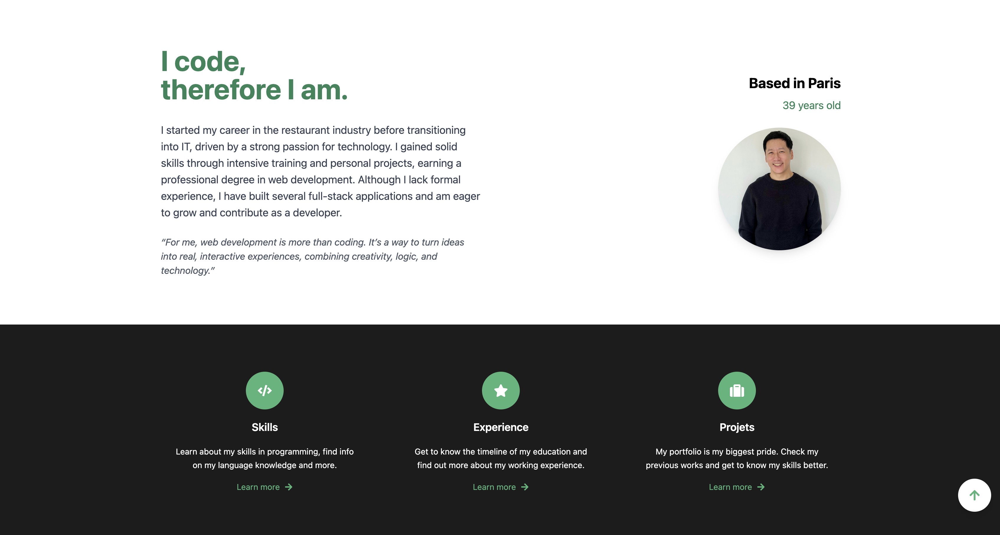
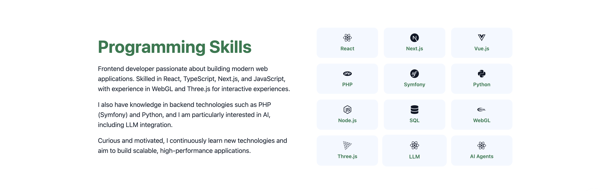
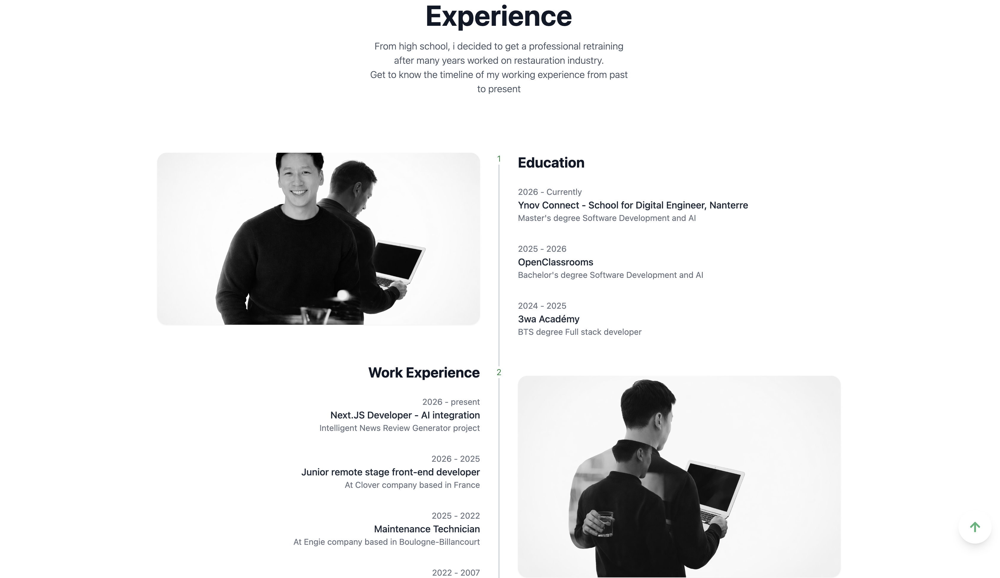
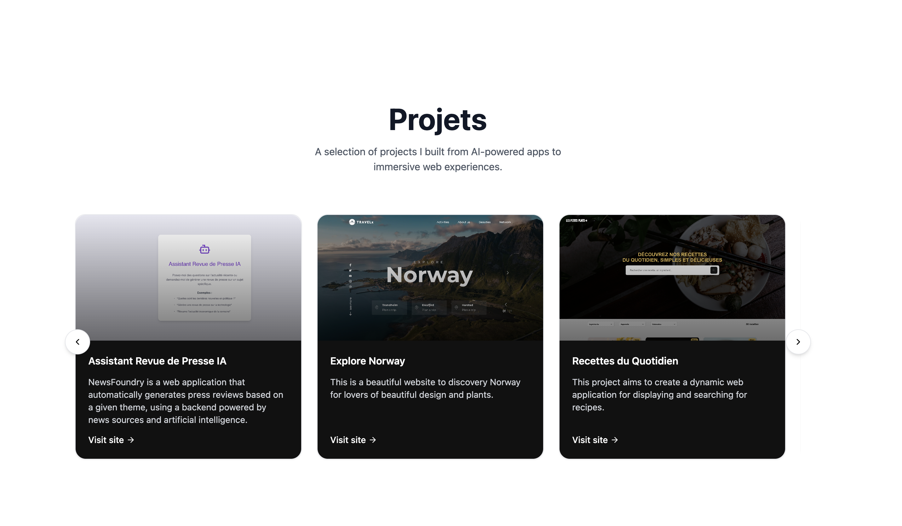
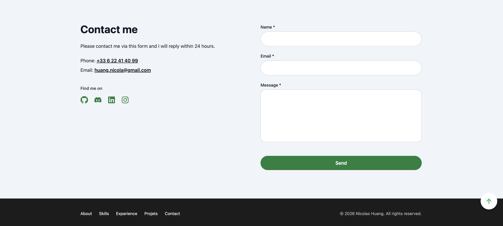

# 🚀 Portfolio – Nicolas Huang

Portfolio personnel développé avec **Next.js**, **React**, et **Tailwind CSS**, présentant mes compétences, projets et expériences en tant que développeur Fullstack & IA.

---

## 🌐 Aperçu

Ce portfolio a été conçu pour mettre en valeur :

- Mes compétences techniques (Frontend / Backend / IA)
- Mes projets personnels et professionnels
- Mon parcours de formation et expériences
- Mes informations de contact

---

## 🧩 Stack technique

- Next.js (App Router)
- React
- TypeScript
- Tailwind CSS
- React Icons
- HTML5 / SEO / Accessibilité (WCAG)
- Git & GitHub

---

## 📸 Aperçu des sections

